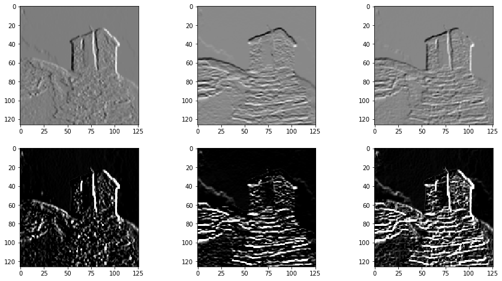

## Repository Tree

```
├── jupyter     // Pynq application
│   └── filter2d_demo.ipynb
├── overlay     // Bitstream and hardware handoff
│   ├── filter2d.bit
│   └── filter2d.hwh
└── src         // HLS design and testbench
    ├── dst.txt
    ├── filter2d.cpp
    ├── filter2d.h
    ├── filter2d_test.cpp
    ├── src.txt
    └── tcl_script.tcl
```
    
## filter2d_accel_pynq

A HLS implementation of 2D convolution algorithm for custom 3\*3 kernel and images smaller than 128\*128, no padding.

**This project was presented at Xilinx Winter Camp 2022.**

- Platform: PYNQ-Z2, Filter2D IP running in 150MHz.

- Python requirements: opencv-python, matplotlib, plotly, pynq

Demo(硬件自定义二维卷积IP核实现图片浮雕效果): [Here](./jupyter/filter2d_demo.ipynb)

Some results: 



