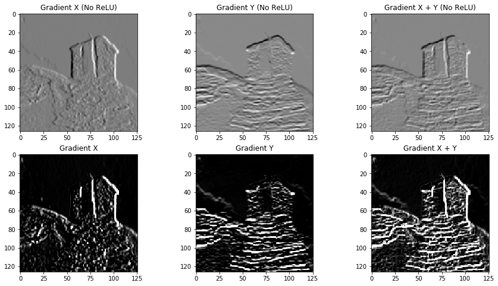

## Repository Tree

```
├── jupyter	// Pynq application
│   └── filter2d_demo.ipynb
├── overlay	// Bitstream and hardware handoff
│   ├── filter2d.bit
│   └── filter2d.hwh
└── src	// HLS design and testbench
    ├── dst.txt
    ├── filter2d.cpp
    ├── filter2d.h
    ├── filter2d_test.cpp
    ├── src.txt
    └── tcl_script.tcl
```
    
## filter2d_accel_pynq

An implementation of 2D convolution algorithm for custom 3*3 kernel(FCLK: 150MHz), no padding.

Some results: 



